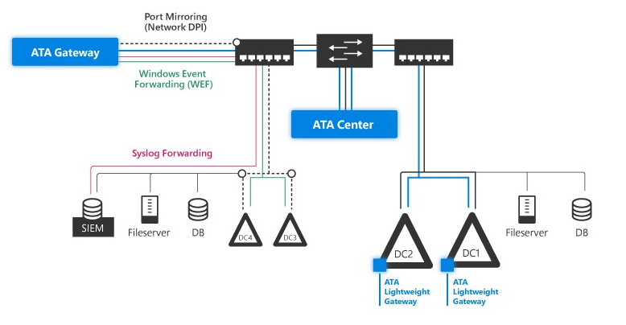

# 什么是ATA

## 讲在前面：

> 本系列文章是笔者在国外研究员的基础上进行翻译并按照其思路进行实际测试，并做出笔者的自我总结和研究结论。笔者依旧力求将该知识点通过讲人话的形式表达出来，希望读者能够通过该系列文章，了解什么是ATA、它的作用、它的检测方式、它的绕过方式等一系列该产品基本知识。

## ATA是什么

### **简述：**

**产品全称【**Advanced Threat Analytics】又名【高级威胁分析】，是微软一款防护域控制器的产品， 用于检测对 Active Directory 的一系列攻击，目前最新版本是1.9版，但微软已经停止对其产品的继续更新和维护。

### **总结：**

* 高级威胁分析 \(ATA\) 是一个本地平台。
* ATA是防护域控的产品。
* 主要是针对流量、日志来进行处理得出分析结果。

## ATA做什么

### 它的数据来源

ATA有两个数据来源。一是流量，二是日志

**解释：**

* 流量：利用其专有的网络解析引擎来捕获和解析多种协议（例如Kerberos、DNS、RPC、NTLM等）网络流量，方式有如下两种：

> * 在域控制器和 DNS 服务器到 ATA 网关**。**
> * 在域控制器上部署 ATA 轻量级网关 \(LGW\) ATA。

* 日志：可以通过如下三种方式来接收事件和日志：

> * SIEM 集成。
> * Windows 事件转发 \(WEF\)。
> * Windows 事件管理器。

### **它**的架构：

* ATA Center：【ATA 中心】
* ATA Gateway：【ATA 网关】
* ATA Lightweight Gateway：【ATA 轻量级网关】

ATA 通过使用物理或虚拟交换机的端口镜像到 ATA网关来监控域控制器网络流量。如果直接在域控制器上部署 ATA 轻量级网关，则不需要端口镜像。

同时，ATA 可以利用 Windows 事件（或直接从域控制器或从 SIEM 服务器转发）分析攻击和威胁数据。

### ATA 组件及部署 

ATA 由以下组件组成：

* **ATA 中心**

> ATA 中心从您部署的任何 ATA 网关和/或 ATA 轻量级网关接收数据。

* **ATA 网关**

> ATA 网关安装在专用服务器上，该服务器使用端口镜像或网络 TAP 监视来自域控制器的流量。

* **ATA 轻量级网关**

> ATA 轻量级网关直接安装在您的域控制器上并直接监控其流量，无需专用服务器或端口镜像配置。它是 ATA 网关的替代品。

**部署ATA：**

> 对于ATA的部署架构也非常简单，安装ATA网关或ATA轻量级网关传输数据给ATA中心。

> * 不需要改变现有的环境以及安装agent，只需要把域控的流量镜像给我们的ATA网关，再有我们的ATA网关将数据传输给我们的ATA中心进行分析处理并展现给用户。
> * 不需要高权限，一个普通的域帐户就可以实现对身份访问的高级安全分析。

**注意：**_我们这里不对实现的方式做细节的解释和演示，这一块的知识可以向我具体了解。_

## ATA和ATP

### 最直观的区别：

* ATA：本地产品，所有数据都在本地。
* ATP：云上产品，收集数据上传至微软云进行分析。

### 详细解读：

在ATA的解决方案中，虽然数据都是在本地，但是需要维护庞大的本地数据库，对没有大量预算的企业来说，这可能也是望而却步的原因之一，所以微软转变了思路，提出云上解决方案：来自域控制器（来自网关或 DC 上的代理）的流量将直接发送到云服务进行分析，不再需要维护内部部署的 mongo 数据库，从而消除了 ATA 的作用中央。

1. Azure ATP 被认为是对本地 ATA 解决方案的基于云的演变。两者都由来自本地域控制器的流量提供。
2. Azure ATP 能够比本地 ATA 解决方案更快地检测到更新的威胁和攻击技术。

ATA:

ATP:

## 题外话

微软的高级威胁防护解决方案项：

| **解决方案**  | **它保护什么？** | **目的**  |
| :--- | :--- | :--- |
| **微软ATA**  | Active Directory | 内部威胁检测、分析和报告  |
|  **Azure ATP**  | Active Directory | 使用云分析和报告进行内部威胁检测  |
| **Windows Defender ATP**  | Desktop | 检测、防御、调查和响应网络上的高级威胁  |
| **Office 365 ATP**  | 云（电子邮件、云存储） | 实时保护组织免受传入电子邮件携带的未知威胁  |

## 参考文章：

* \*\*\*\*[什么是高级威胁分析ATA](https://docs.microsoft.com/en-us/advanced-threat-analytics/what-is-ata)

